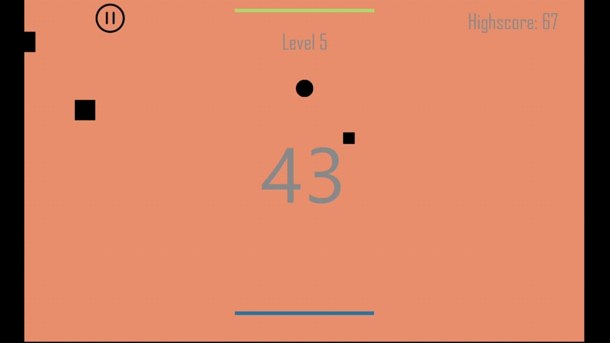
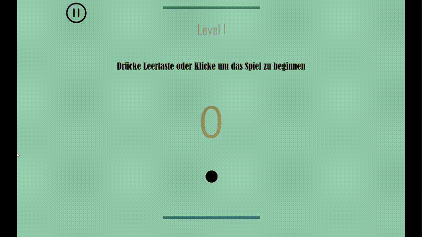
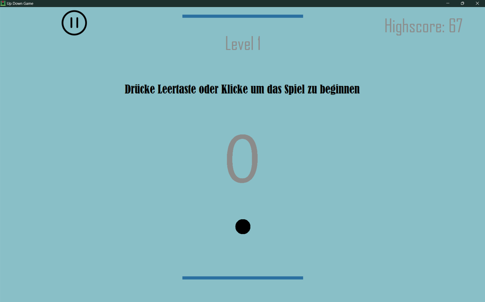
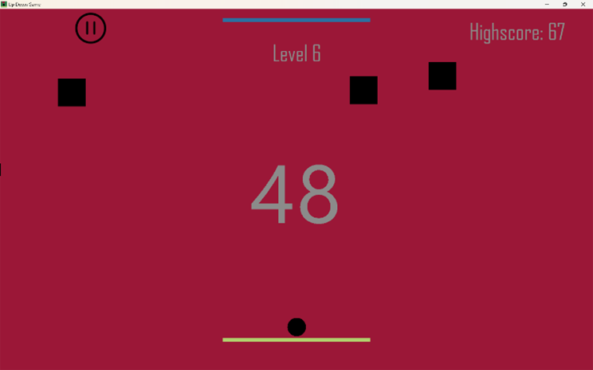
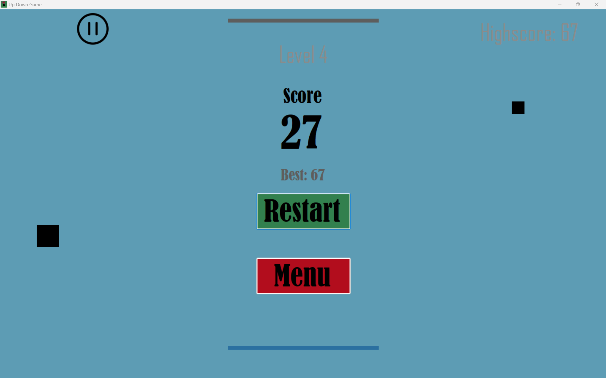

# Up-Down-Game

**A fast-paced reflex game where your goal is simple:**  
🟢 Move between the top and bottom bars to score points – and dodge everything in your way.

---

## 🎮 Gameplay Overview

You control a ball that automatically moves up or down. Your job is to:
- Switch directions by pressing `Space` or clicking.
- Touch the **active bar** (blue) to score points.
- Avoid the **obstacles** (red squares) flying in from both sides.

Each successful touch:
- Increases your score.
- Deactivates the bar you touched (turns grey).
- Forces you to move toward the **opposite** bar to keep scoring.

---

## 📘 Tutorial

Not sure how the game works? Here's a quick walkthrough:

This short tutorial shows how to:
- Start the game
- Switch direction at the right moment
- Score points
- Avoid obstacles

---

## 🧠 Features

- Smooth and responsive 2D controls  
- Dynamic difficulty: speed and obstacle count increase as you play  
- Random obstacle sizes and spawn sides  
- Local **highscore system**  
- **Level system** with background color changes  
- **Sound effects and background music**  
- Game Over screen with restart option  
- Built-in tutorial to onboard new players  

---

## 🖥️ Screenshots

### Game Start

<!-- 
 -->
### In Action

### Game Over
[Game Over screenshot](assets/gameover.png)

---

| Game Start | In Action | Game Over |
|-----------|-----------|------------|
|  |  |  |

---

## 📦 Download

You can download and try the game right away:

➡️ [Download Installer (.exe)](downloads/up_down_game_Installer.exe)

---

## 🛠️ Built With

- **C#**  
- **Windows Forms / WinForms**  
- Custom logic, no external game engines

> This was one of my **first real game projects** – built from scratch as a challenge and a learning experience.

---

## 📸 Fun to Watch, Fun to Play

If you just want to get a quick feel for the game, check out the GIFs above.  
It's simple to understand – but tricky to master!

---

## 📁 Folder Structure

Up-Down-Game/ 
├── assets/ # Gameplay GIFs and screenshots 
│   ├── updown-gameplay.gif 
│   ├── tutorial.gif 
│   ├── start.png 
│   ├── action.png 
│   └── gameover.png 
├── downloads/ # Installer for the game 
│   └── UpDownGameInstaller.exe 
├── GameProjectFiles/ # All relevant code and resources 
├── Up Down Game.sln # Solution file 
└── README.md # This file
