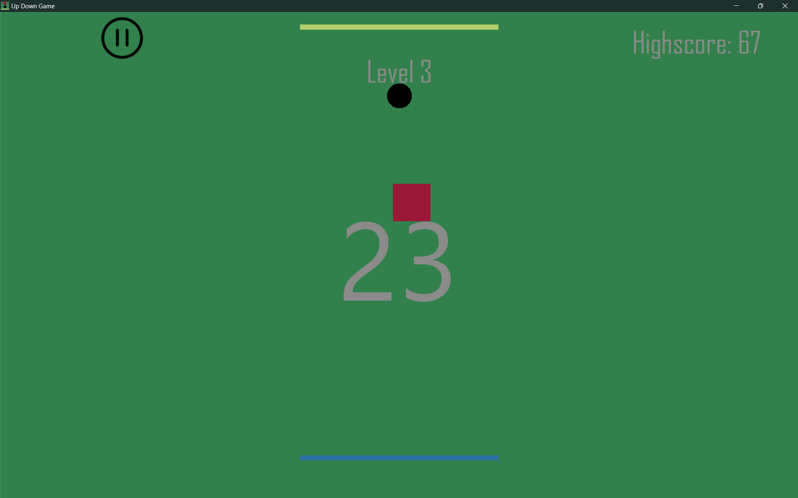

# Up-Down-Game

**A fast-paced reflex game where your goal is simple:**  
🟢 Move between the top and bottom bars to score points – and dodge everything in your way.

---

## 🎮 Gameplay Overview

You control a ball that automatically moves up or down. Your job is to:
- Switch directions by pressing `Space` or clicking.
- Touch the **active bar** (blue) to score points.
- Avoid the **obstacles** (red squares) flying in from both sides.

Each successful touch:
- Increases your score.
- Deactivates the bar you touched (turns grey).
- Forces you to move toward the **opposite** bar to keep scoring.

---

## 🧠 Features

- Smooth and responsive 2D controls  
- Dynamic difficulty: speed and obstacle count increase as you play  
- Random obstacle sizes and spawn sides  
- Local **highscore system**  
- **Level system** with background color changes  
- Game Over screen with restart option  
- Built-in tutorial to onboard new players  

---

## 🖥️ Screenshots

| Game Start | In Action | Game Over |
|-----------|-----------|------------|
|  |  |  |

*(Optional – add these screenshots to the `assets/` folder and name them entsprechend.)*

---

## 📦 Download

You can download and try the game right away:

➡️ [Download Installer (.exe)](downloads/UpDownGameInstaller.exe)

---

## 🛠️ Built With

- **C#**  
- **Windows Forms / WinForms**  
- Custom logic, no external game engines

> This was one of my **first real game projects** – built from scratch as a challenge and a learning experience.

---

## ✏️ Future Ideas

- Sound effects & music  
- Online leaderboard  
- Power-ups or special modes  

---

## 📸 Fun to Watch, Fun to Play

If you just want to get a quick feel for the game, check out the GIF at the top.  
It's simple to understand – but tricky to master!

---

## 📁 Folder Structure

Up-Down-Game/
├── assets/ # Gameplay GIFs and screenshots
├── downloads/ # Installer for the game
├── GameProjectFiles/ # All relevant code and resources
├── Up Down Game.sln # Solution file
└── README.md # This file